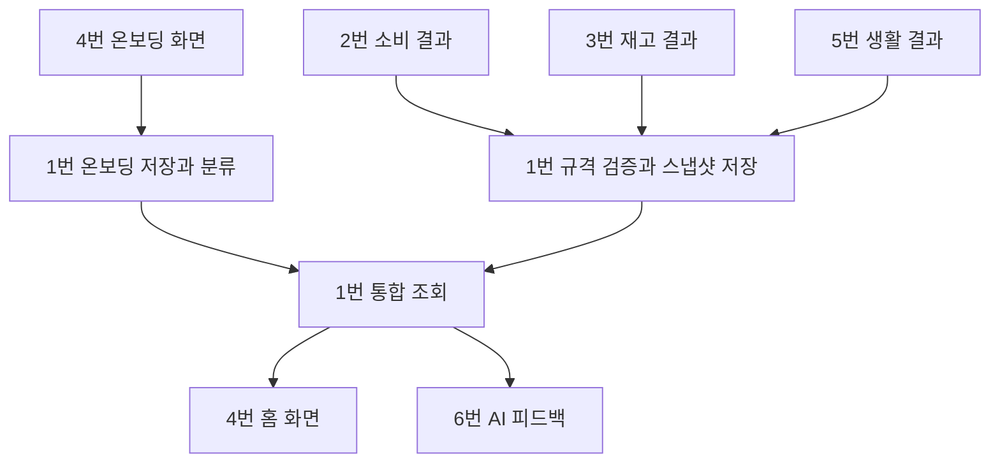

# 팀 연결 규격 v1.0 — 합의용 초안

## 역할과 책임

- 1번: 온보딩·공통 계약·조회용 통합 데이터. 원본 업무 계산을 대신하지 않음.
- 2번: 지출/예산 계산 결과 SpendingSnapshot 제공. OCR 문구 원본은 중앙 코어에 불필요.
- 3번: InventorySnapshot 제공. 원본 품목·소비·폐기·날짜 근거 관리는 3번 소유.
- 4번: 온보딩 PUT/GET, dashboard GET. target은 Flutter에서 매핑할 화면 경로이며 서버 URL이 아님.
- 5번: LifeSnapshot 제공. 반복 일정 계산과 변경/완료 처리는 5번 소유.
- 6번: ai-context GET 결과로 LLM 호출. 빠진 자료를 0으로 해석하지 말 것.

## 공통 규칙

금액은 원 단위 JSON 정수, null은 모름/미설정, 빈 목록은 확인된 0건.
수량과 단위는 함께 제공. source_updated_at은 시간대 포함 ISO8601.
원천 데이터 갱신 시각을 넣고 단순 재조회 때 현재 시각으로 바꾸지 않음.
서버는 현재보다 5분 이상 미래, 이전 스냅샷, 같은 시각의 서로 다른 내용을 거부.
동일 스냅샷 재전송은 허용. 전체 목록 교체이므로 페이지 일부를 보내면 안 됨.
모든 계약은 extra 필드를 거부하며 변경은 schema_version 합의 후 수행.
module_status는 missing/available/stale. available은 최신성 기준일 뿐 내용의 사실성을 보장하지 않음.

온보딩 예산은 목표 입력이고 spending.budget_krw는 2번이 적용한 현재 월 예산.
두 값을 자동 동기화하지 않음. 2번은 온보딩 목표를 가져와 사용자 확인 후 예산에 반영.

JSON Schema는 schemas/*.json, 전체 API 계약은 docs/openapi.json.
/api/v1/dev/me/modules/*는 로컬 시연용입니다. 실서비스에서는 사용자에게 쓰기 권한을
노출하지 말고 모듈 서비스 함수를 통해 같은 검증 계약을 적용하세요.

## 온보딩 규칙

거주 개월 미입력=unknown / 0~5=new / 6 이상=experienced.
조리도구 null=unknown / []=no_tools / 전자레인지만=microwave_only / 그 외=equipped.
주당 요리일 미입력=unknown / 0~2=rare / 3~7=regular.
이는 제품 분류용 임시 규칙이며 건강·역량 진단이 아닙니다.

## 흐름

## 팀원에게 먼저 확인할 사항

1. 필드와 단위가 각 파트 결과에 맞는지
2. 초기 재고 입력 화면과 원본 저장 책임(3번) 확인
3. 예산 설정 변경을 2번이 어떤 함수로 처리할지
4. 스냅샷 갱신 시점과 실패 시 재전송 규칙
5. 실사용 로그인 담당과 검증된 사용자 ID 전달 방식
